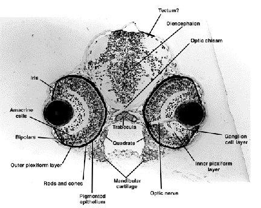

## Gene

- Notch

## Organ System

- Eye (Zebrafish)
  

# Outline

1.  General Info

- zebrafish Notch gene, Eye organ system
- Use zfin to gather gene function summarry, expression, and phenotypes

2.  Background Info

- Notch gene description, sequence, known alleless. Find out expression in zebrafish eye
- Get relevant/interesting annotations
- Developmental stages of activity in eye

3. Find Literature

- PubMed notch function in eye
- Find a paper focusing on a spcific function

4. Describe function in eye

- Include evidence from selected paper
- Get supporing figures

5. Propose experiemnet to further understanding

- hypothesis
- experiemntal design
- define possible outcomes
- explanation of results relevant to Notch
- alternative approaches

6. if time allows....

   - Get RNASeq data where notch is knocked out or expression is changed in some way...
   - compare wild type to the mutants..
   - find a way to measure the changes in expression
   - PCA + heatmaps?

# Resources To Use

_Nov 4 Group Members_

<inline>
- Bianca
- Firuza
- Long
</inline>

## Zfin

- Genes alllows you to search for a gene
- <mark>expression allows you to search for the expression of genes at various stages and physiological locations</mark>
- Antibodies allow you to look for antibodies such as the rabbit polyclonal anti-Jag1b that cites Yamamoto et al., 2010
- <mark>AllianceMine allows you to go through input lists of genes and search annotations across species. This would be useful for comparing gene associated with a specific disease term in dfferent species.</mark>
- News shows the latest news about zfin. They recently updated the site to use NCBI data for the reference genome, GRCz12tu. This is a 1.4Gb genome with 37% GC content. I forgot what BUSCO scores are, but it's 97.7% single copy.

## Xenbase

- Gene Expression search allows you to search for expression data for a gene
- <mark>RNA-Seq stages and tissues allow you to see RNA-Seq data from various Xenopus papers</mark>
- <mark>Anatomy Search allows you to search, via a tree format, different anatomical structure sand their porigins</mark>
- Cell Fate Maps shows face maps in forward and reverse at various stages
- <mark>Disease models allows you to search for various disease states, experiments involving them, and other information</mark>

## Wormbase

- Directory let's you browse worm information by species and database/resource
- Tools provides tools like BLAST, genetic maps, aligners, etc.
- Downloads allows you to download data directly
- Community gives you access to the forums, other websites, and a colleague database
- Citing WormBase provides resoruces to cite anything on wormbase
